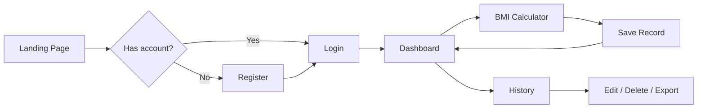
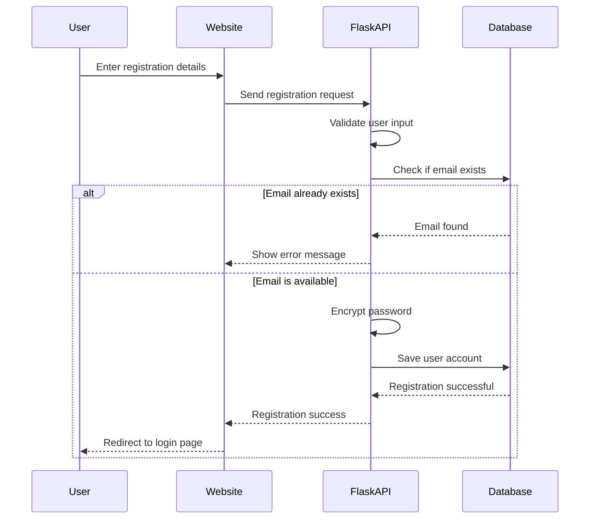
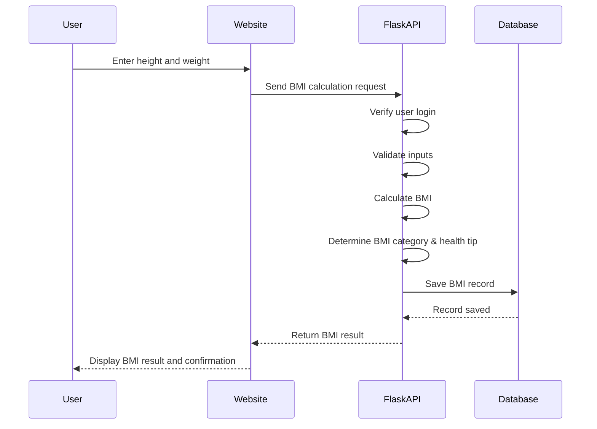

# Methodology/Process

## BMI Calculator System

---

## 1. Project Overview

### 1.1 Problem Statement

Manual BMI tracking (paper notes, spreadsheets) is error-prone, hard to search, and does not show trends over time. Users need a secure web application to calculate BMI, store history per account, and view progress through charts and statistics.

### 1.2 Objectives


| Objective                    | How the system addresses it                                  |
| ---------------------------- | ------------------------------------------------------------ |
| Accurate BMI computation     | Server-side formula: BMI = weight (kg) ÷ (height in m)²      |
| Personalized health guidance | Category-based tips (Underweight, Normal, Overweight, Obese) |
| Long-term monitoring         | Persistent records in MySQL with dashboard trends            |
| Secure access                | Registration, hashed passwords, session-based authentication |
| Usable interface             | Responsive HTML/Tailwind UI with real-time API feedback      |


### 1.3 Scope

**In scope:** User registration/login, BMI calculator, record history (view, edit, delete, search, pagination), dashboard statistics, chart visualization, CSV export, form validation, dark mode (client-side preference).

---

## 2. Research & Development Methodology

### 2.1 Approach: Modified Waterfall with Iterative Refinement

The project follows a **structured SDLC (Software Development Life Cycle)** suitable for academic capstone work, with short feedback loops during implementation and testing.


| Phase                    | Activities                                   | Deliverables                     |
| ------------------------ | -------------------------------------------- | -------------------------------- |
| **1. Planning**          | Define problem, objectives, scope, tools     | Project proposal, feature list   |
| **2. Requirements**      | Gather functional & non-functional needs     | Requirements specification       |
| **3. Analysis & Design** | ERD, architecture, UI wireframes, API design | Database schema, system diagrams |
| **4. Implementation**    | Backend API, frontend pages, database setup  | Working prototype → full system  |
| **5. Testing**           | Unit checks, integration, user acceptance    | Test cases, bug fixes            |
| **6. Deployment**        | XAMPP + Flask server, documentation          | Deployed system, user guide      |


**Why this approach:** Requirements (BMI formula, categories, user accounts) are well-defined early. The team can implement backend logic and database first, then connect the frontend via REST APIs—a clear order that matches the actual codebase (`backend/app.py`, `frontend/`, `backend/database.sql`).

### 2.2 Requirements Gathering Methods

- **Document analysis** — WHO BMI classification standards
- **Comparative study** — Review of existing online BMI calculators
- **Developer-driven specification** — Feature list aligned with course objectives (authentication, CRUD, charts, validation)

### 2.3 BMI Classification Standard (WHO)

The system uses internationally recognized adult BMI ranges:


| BMI Range   | Category    | System behavior                                 |
| ----------- | ----------- | ----------------------------------------------- |
| < 18.5      | Underweight | Stores category + underweight health tip        |
| 18.5 – 24.9 | Normal      | Stores category + maintenance tip               |
| 25.0 – 29.9 | Overweight  | Stores category + activity/diet tip             |
| ≥ 30.0      | Obese       | Stores category + professional consultation tip |


**Formula implemented in backend:**

```
height_m = height_cm / 100
BMI = weight_kg / (height_m)²
Result rounded to 2 decimal places
```

---

## 3. System Development Process (Step-by-Step)

### Phase 1: Planning & Requirements

1. Identify target users (individuals tracking personal health).
2. List core features: auth, calculator, history, dashboard, export.
3. Select stack: **Python Flask** (API + server), **MySQL** (data), **HTML/CSS/JS** (UI), **Tailwind CSS** (styling), **Chart.js** (graphs).

### Phase 2: System Analysis & Design

#### 2.1 System Architecture (Three-Tier)

```
┌─────────────────────────────────────────────────────────────┐
│                    PRESENTATION LAYER                       │
│  HTML pages: index, login, register, dashboard, calculator, │
│  history, edit | JavaScript (api.js, session.js) | Tailwind │
└──────────────────────────┬──────────────────────────────────┘
                           │ HTTP/JSON (Fetch API, credentials)
                           ▼
┌─────────────────────────────────────────────────────────────┐
│                    APPLICATION LAYER                        │
│  Flask (app.py): routes, validation, BMI logic, sessions,   │
│  CORS, login_required / api_login_required decorators       │
└──────────────────────────┬──────────────────────────────────┘
                           │ SQL (Flask-MySQLdb)
                           ▼
┌─────────────────────────────────────────────────────────────┐
│                      DATA LAYER                             │
│  MySQL: bmi_calculator_system                               │
│  Tables: users, bmi_records (FK user_id ON DELETE CASCADE)  │
└─────────────────────────────────────────────────────────────┘
```

#### 2.2 Database Design

- `**users**` — Account data (fullname, email, hashed password, age, gender).
- `**bmi_records**` — Per-user measurements (height, weight, bmi, category, health_tip, timestamp).
- **Indexes** on `user_id`, `email`, `created_at` for faster queries.

#### 2.3 API Design Pattern

REST-style JSON endpoints under `/api/*`, with Flask server sessions for authentication (`credentials: 'include'` on the client).


| Endpoint               | Method   | Purpose                           |
| ---------------------- | -------- | --------------------------------- |
| `/api/register`        | POST     | Create account                    |
| `/api/login`           | POST     | Authenticate, start session       |
| `/api/logout`          | POST     | End session                       |
| `/api/profile`         | GET      | Verify session / load user        |
| `/api/calculator`      | POST     | Calculate BMI and save record     |
| `/api/calculate-bmi`   | POST     | Calculate only (no save)          |
| `/api/history`         | GET      | Paginated history + search/filter |
| `/api/edit/<id>`       | GET/POST | View or update record             |
| `/api/delete/<id>`     | DELETE   | Remove record                     |
| `/api/export`          | GET      | Download CSV                      |
| `/api/dashboard-stats` | GET      | Stats + recent records            |
| `/api/chart-data`      | GET      | Line & pie chart data             |


### Phase 3: Implementation

#### 3.1 Backend Development Order

1. Database schema (`database.sql`) — create DB and tables.
2. Helper functions — `calculate_bmi()`, `get_bmi_category()`, `get_health_tip()`, `get_user_stats()`.
3. Authentication — register, login, password hashing (`werkzeug.security`).
4. Protected routes — `@api_login_required` for JSON APIs.
5. BMI CRUD — insert on calculate, history, edit, delete, export.
6. Analytics — dashboard stats and chart data aggregation.

#### 3.2 Frontend Development Order

1. Static pages and shared styling (`css/app.css`, Tailwind).
2. API client (`js/api.js`) — dynamic base URL (Flask port 5000 vs XAMPP port 80).
3. Session manager (`js/session.js`) — localStorage + server profile verification.
4. Page-specific scripts — dashboard charts, calculator, history table.

#### 3.3 Security Measures Implemented


| Concern                      | Implementation                                         |
| ---------------------------- | ------------------------------------------------------ |
| Password storage             | `generate_password_hash` / `check_password_hash`       |
| Session hijacking mitigation | HttpOnly session cookie, server-side `user_id`         |
| Unauthorized API access      | `api_login_required` returns 401 JSON                  |
| Data isolation               | All queries filter by `session['user_id']`             |
| Input validation             | Positive height/weight, realistic max (300 cm, 500 kg) |
| SQL injection                | Parameterized queries (`%s` placeholders)              |


### Phase 4: Testing Methodology


| Test type       | What was verified                                                                        |
| --------------- | ---------------------------------------------------------------------------------------- |
| **Functional**  | Register, login, logout, BMI calculation, save, edit, delete, search, pagination, export |
| **Validation**  | Empty fields, short password, duplicate email, invalid height/weight                     |
| **Integration** | Frontend Fetch calls ↔ Flask API ↔ MySQL                                                 |
| **Security**    | Access protected pages without login → redirect / 401                                    |
| **Usability**   | Responsive layout, error messages, dashboard charts load                                 |


### Phase 5: Deployment Process

1. Install **XAMPP** — start Apache (optional, for static frontend) and **MySQL**.
2. Import `**backend/database.sql`** via phpMyAdmin or MySQL CLI.
3. Create Python virtual environment and install dependencies (`backend/requirements.txt`).
4. Run `**start_server.bat`** — starts Flask on `http://127.0.0.1:5000`.
5. Open frontend via Flask (`/`) or XAMPP path; API calls target port 5000 when needed.

---

### 4.1 End-to-End User Journey




### 4.2 User Registration Process




### 4.3 BMI Calculation & Save Process




### 4.4 Dashboard Data Process

1. User opens **Dashboard** → `verifyAuth()` calls `/api/profile`.
2. Page loads `**/api/dashboard-stats`** — total records, latest BMI, average BMI, category counts, 5 recent entries.
3. Page loads `**/api/chart-data`** — last 30 records for line chart (BMI over time) and pie chart (category distribution).
4. User navigates to Calculator or History from quick actions.

### 4.5 History Management Process


| Action     | User step         | System process                                                             |
| ---------- | ----------------- | -------------------------------------------------------------------------- |
| **View**   | Open History page | GET `/api/history?page=&search=&category=` → paginated table (10 per page) |
| **Search** | Type keyword      | Filters category or health_tip (LIKE query)                                |
| **Filter** | Select category   | Adds `category =` condition                                                |
| **Edit**   | Open edit page    | GET record → POST updated height/weight → recalculate BMI & update row     |
| **Delete** | Confirm delete    | DELETE `/api/delete/<id>` — only if `user_id` matches                      |
| **Export** | Click Export      | GET `/api/export` → CSV download                                           |


---

## 5. Technology Stack & Justification


| Layer           | Technology                             | Justification                                                      |
| --------------- | -------------------------------------- | ------------------------------------------------------------------ |
| Backend         | Python 3, Flask 3                      | Lightweight, fast to develop REST APIs, good for academic projects |
| Database        | MySQL (XAMPP)                          | Relational data, familiar tooling, foreign keys for user records   |
| Frontend        | HTML5, Tailwind CSS                    | No build step required; responsive utility classes                 |
| Client logic    | Vanilla JavaScript, Fetch API          | Simple async calls, session cookies with `credentials: 'include'`  |
| Charts          | Chart.js                               | Clear BMI trend and category visualization                         |
| Security        | Werkzeug hashing, Flask sessions       | Industry-standard password handling                                |
| Dev environment | XAMPP, Python venv, `start_server.bat` | Matches local school/lab deployment                                |


---

## 6. Data Flow Summary

```
User Input (height, weight)
        ↓
Frontend validation (client-side)
        ↓
POST /api/calculator (JSON + session)
        ↓
Flask: validate → calculate_bmi() → get_bmi_category() → get_health_tip()
        ↓
INSERT bmi_records (user_id from session)
        ↓
JSON response → UI update
        ↓
Dashboard / History / Charts read from same tables
```

---

## 7. Limitations & Ethical Considerations

**Limitations**

- BMI is a screening tool, not a diagnostic; it does not account for muscle mass, age-specific pediatric ranges, or ethnicity-specific adjustments.
- Health tips are general guidance, not medical advice.
- System runs on localhost; production would require HTTPS, strong `secret_key`, and environment-based DB credentials.

**Ethical use**

- Users should consult healthcare professionals for clinical decisions.
- Personal data is stored per account; users should use strong passwords and log out on shared devices.

---

---

## Appendix A: File Structure Reference

```
BMI SYSTEM/
├── backend/
│   ├── app.py              # Flask application & API
│   ├── database.sql        # MySQL schema
│   └── requirements.txt    # Python dependencies
├── frontend/
│   ├── index.html          # Landing page
│   ├── login.html / register.html
│   ├── dashboard.html      # Stats & charts
│   ├── calculator.html     # BMI input & results
│   ├── history.html / edit.html
│   ├── js/api.js           # API client
│   └── js/session.js       # Auth & UI helpers
├── start_server.bat        # Run Flask API
└── METHODOLOGY.md          # This document
```

---

## Appendix B: Features Implemented

- User registration & login
- Real-time BMI calculation
- Automatic BMI category detection (Underweight, Normal, Overweight, Obese)
- Personalized health tips based on BMI
- View BMI history with pagination
- Dashboard with statistics & BMI trends
- Age & Gender input support
- Form validation & error handling

---

## Appendix C: Technology Stack

- **Backend:** Python/Flask, MySQL
- **Frontend:** HTML5, Tailwind CSS, Font Awesome icons
- **JavaScript:** Fetch API for async requests, Session management
- **Styling:** Tailwind CSS