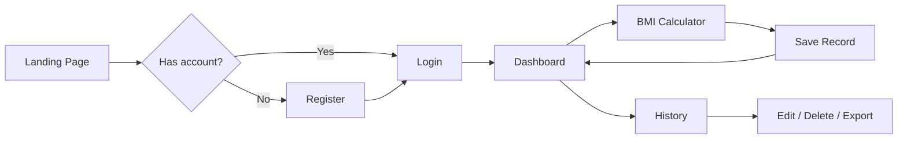
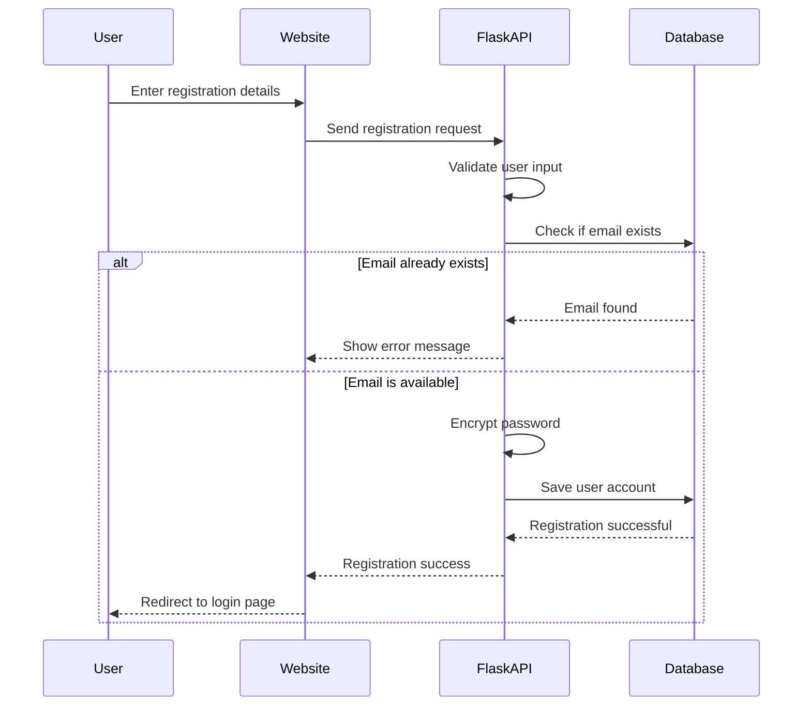
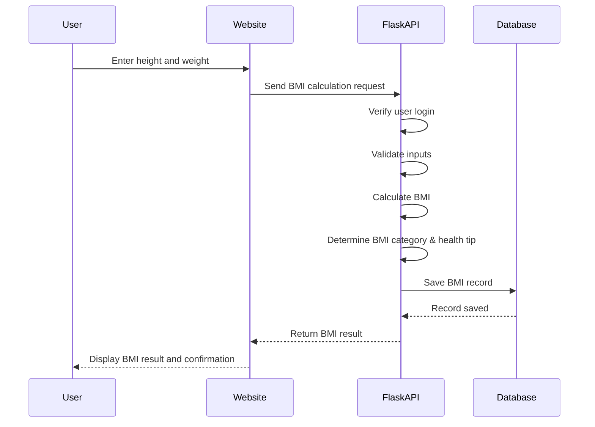

# BMI Calculator System
---

## 1. Project Title and Introduction

### Project Title

**BMI Calculator System**

A web-based health tracking application that computes Body Mass Index (BMI), classifies results using WHO standards, stores personal health records, and visualizes progress through a secure user dashboard.

### Introduction

Many people track BMI using paper notes or spreadsheets. This is slow, easy to lose, and hard to analyze over time. The **BMI Calculator System** solves this by providing a **secure online platform** where users can:

- Create a personal account
- Calculate BMI instantly
- Receive category-based health tips
- Save and review past measurements
- View trends on a dashboard with charts

### Problem Statement

Manual BMI tracking is error-prone, difficult to search, and does not show health trends over time. Users need a **centralized, secure web application** to calculate BMI, store history per account, and monitor progress with statistics and charts.

### Target Users

- Students and individuals monitoring personal health
- Users who want a simple digital BMI log with visual progress
- Anyone learning web development concepts (authentication, CRUD, REST API, database)

### System Type

- **Web application** (browser-based)
- **Architecture:** Three-tier (Frontend → Flask API → MySQL)
- **Deployment:** Localhost via XAMPP + Python Flask (`start_server.bat`)

---

## 2. Objectives of the System

### General Objective

To design and develop a **web-based BMI Calculator System** that allows users to compute BMI accurately, store measurement history, and monitor health progress through an interactive dashboard.

### Specific Objectives

| # | Objective | How the system achieves it |
| - | --------- | --------------------------- |
| 1 | Provide accurate BMI computation | Server-side formula: `BMI = weight (kg) ÷ (height in m)²` (height entered in cm) |
| 2 | Classify BMI automatically | WHO categories: Underweight, Normal, Overweight, Obese |
| 3 | Give personalized health guidance | Health tips generated per category after each calculation |
| 4 | Enable secure user access | Registration, login, password hashing, Flask session authentication |
| 5 | Store and manage BMI history | MySQL database with CRUD: view, edit, delete, search, pagination |
| 6 | Visualize health progress | Dashboard with statistics, line chart (BMI trend), pie chart (categories) |
| 7 | Support user profile data | Age and gender captured during registration |
| 8 | Ensure data quality and safety | Form validation, input limits, parameterized SQL, per-user data isolation |

### Scope

**Included:** Registration/login, BMI calculator, history management, dashboard analytics, CSV export, responsive UI, validation and error handling.

---

## 3. System Features and Functionalities

### 3.1 Features Implemented (Summary)

- User registration & login
- Real-time BMI calculation
- Automatic BMI category detection (Underweight, Normal, Overweight, Obese)
- Personalized health tips based on BMI
- View BMI history with pagination
- Dashboard with statistics & BMI trends
- Age & gender input support
- Form validation & error handling

### 3.2 Features by Module

#### A. Authentication Module

| Feature | Functionality |
| ------- | ------------- |
| Register | User signs up with full name, email, password, age, gender |
| Login | Email/password validation; session created on success |
| Logout | Session cleared; user returned to login |
| Profile check | Protected pages verify login via `/api/profile` |

#### B. BMI Calculator Module

| Feature | Functionality |
| ------- | ------------- |
| Input height & weight | Height in cm, weight in kg |
| Real-time calculation | API computes BMI before or on save |
| Category detection | Underweight / Normal / Overweight / Obese |
| Health tips | Tip text based on category |
| Save record | Each calculation stored in `bmi_records` table |
| Validation | Rejects empty, negative, or unrealistic values |

#### C. Dashboard Module

| Feature | Functionality |
| ------- | ------------- |
| Statistics cards | Total records, latest BMI, average BMI, normal count |
| Recent records | Last 5 BMI entries |
| Line chart | BMI trend over time (Chart.js) |
| Pie chart | Distribution by category |
| Quick actions | Links to Calculator and History |

#### D. History Module

| Feature | Functionality |
| ------- | ------------- |
| View all records | Paginated list (10 per page) |
| Search | Filter by category or health tip keyword |
| Filter | Filter by BMI category |
| Edit record | Update height/weight; BMI recalculated |
| Delete record | Remove entry (user-owned only) |
| Export CSV | Download full history as `bmi_history.csv` |

#### E. User Interface

| Feature | Functionality |
| ------- | ------------- |
| Landing page | Project overview and feature highlights |
| Responsive design | Tailwind CSS — desktop, tablet, mobile |
| Icons | Font Awesome for navigation and cards |
| Session UI | User name on dashboard; redirect if not logged in |

### 3.3 BMI Classification (WHO Standard)

| BMI Range | Category | System output |
| --------- | -------- | ------------- |
| Below 18.5 | Underweight | Category + weight-gain guidance tip |
| 18.5 – 24.9 | Normal | Category + maintenance tip |
| 25.0 – 29.9 | Overweight | Category + diet/activity tip |
| 30.0 and above | Obese | Category + professional consultation tip |

**Formula:**

```
height_m = height_cm / 100
BMI = weight_kg / (height_m)²
(Result rounded to 2 decimal places)
```

---

## 4. Methodology/Process

### 4.1 Development Approach

The project uses a **Modified Waterfall with Iterative Refinement** — a structured **Software Development Life Cycle (SDLC)** suitable for academic projects, with testing and fixes during implementation.

| Phase | Activities | Output |
| ----- | ---------- | ------ |
| 1. Planning | Problem definition, objectives, scope, tool selection | Project plan, feature list |
| 2. Requirements | Functional & non-functional requirements | Requirements list |
| 3. Analysis & Design | ERD, architecture, API design, UI pages | `database.sql`, system diagrams |
| 4. Implementation | Backend, frontend, database integration | Working system |
| 5. Testing | Functional, validation, integration, security tests | Verified features |
| 6. Deployment | XAMPP, MySQL import, Flask server | Runnable application |

**Requirements gathering:**

- Document analysis (WHO BMI standards)
- Comparative study (existing online BMI tools)
- Feature alignment with course requirements (auth, CRUD, charts)

### 4.2 System Architecture (Three-Tier)

```
┌─────────────────────────────────────────────────────────────┐
│                    PRESENTATION LAYER                       │
│  HTML pages: index, login, register, dashboard, calculator, │
│  history, edit | JavaScript (api.js, session.js) | Tailwind │
└──────────────────────────┬──────────────────────────────────┘
                           │ HTTP/JSON (Fetch API, credentials)
                           ▼
┌─────────────────────────────────────────────────────────────┐
│                    APPLICATION LAYER                        │
│  Flask (app.py): routes, validation, BMI logic, sessions    │
└──────────────────────────┬──────────────────────────────────┘
                           │ SQL (Flask-MySQLdb)
                           ▼
┌─────────────────────────────────────────────────────────────┐
│                      DATA LAYER                             │
│  MySQL: bmi_calculator_system                             │
│  Tables: users, bmi_records                                 │
└─────────────────────────────────────────────────────────────┘
```

### 4.3 Database Design

| Table | Purpose | Key fields |
| ----- | ------- | ---------- |
| `users` | User accounts | fullname, email, password (hashed), age, gender |
| `bmi_records` | BMI measurements | user_id, height, weight, bmi, category, health_tip, created_at |

Relationship: One user → many BMI records (`ON DELETE CASCADE`).

### 4.4 Implementation Process

**Backend (Python/Flask):**

1. Create database schema (`backend/database.sql`)
2. Build helper functions: `calculate_bmi()`, `get_bmi_category()`, `get_health_tip()`
3. Implement authentication (register, login, hashed passwords)
4. Create REST API endpoints under `/api/*`
5. Add dashboard stats and chart data APIs

**Frontend (HTML/JavaScript):**

1. Design pages with Tailwind CSS
2. Connect API via `frontend/js/api.js` (Fetch API)
3. Manage session via `frontend/js/session.js`
4. Integrate Chart.js on dashboard

### 4.5 System Process Flows

> View rendered charts in `methodology-viewer.html` (Diagrams tab).

#### 4.5.1 End-to-End User Journey



#### 4.5.2 User Registration Process



#### 4.5.3 BMI Calculation & Save Process



#### 4.5.4 History Management

| Action | User step | System process |
| ------ | --------- | -------------- |
| View | Open History | Paginated table (10 per page) |
| Search | Type keyword | Filters category or health tip |
| Filter | Select category | Shows matching records only |
| Edit | Update height/weight | BMI recalculated and saved |
| Delete | Confirm delete | Record removed from database |
| Export | Click Export | CSV file download |

### 4.6 Testing Methodology

| Test type | What was tested |
| --------- | --------------- |
| Functional | Register, login, calculate, save, edit, delete, export |
| Validation | Empty fields, short password, duplicate email, invalid inputs |
| Integration | Frontend ↔ Flask API ↔ MySQL |
| Security | Protected routes without login → redirect / 401 |
| Usability | Responsive layout, charts, error messages |

### 4.7 Deployment Process

1. Start **XAMPP** (Apache + MySQL)
2. Import **`backend/database.sql`** in phpMyAdmin
3. Install Python packages (`backend/requirements.txt`)
4. Run **`start_server.bat`** (Flask on port 5000)
5. Open: `http://localhost/BMI%20SYSTEM/frontend/index.html` or Flask root URL

---

## 5. Demonstration Overview

Use this section as your **live demo script** during the presentation.

### 5.1 Before the Demo (Setup Checklist)

| Step | Action |
| ---- | ------ |
| 1 | Start XAMPP — MySQL running |
| 2 | Run `start_server.bat` — Flask API on `http://127.0.0.1:5000` |
| 3 | Open browser to landing page (`frontend/index.html` or Flask `/`) |
| 4 | Prepare a test account (or register live during demo) |

### 5.2 Demo Flow (Recommended Order)

| Step | Page | What to show | What to explain |
| ---- | ---- | ------------ | --------------- |
| 1 | **Landing Page** (`index.html`) | Hero, features, BMI categories | Introduce the system purpose and main capabilities |
| 2 | **Register** (`register.html`) | Fill name, email, password, age, gender → Submit | User account creation; validation (password length, duplicate email) |
| 3 | **Login** (`login.html`) | Login with registered account | Secure authentication; session starts |
| 4 | **Dashboard** (`dashboard.html`) | Stats cards, charts, recent records | Overview of user health data and trends |
| 5 | **Calculator** (`calculator.html`) | Enter height (cm) and weight (kg) → Calculate | Real-time BMI, category, and health tip; record saved to database |
| 6 | **Dashboard** (again) | Refresh — new record appears | Data updates after each calculation |
| 7 | **History** (`history.html`) | List of records, search, filter | Pagination and record management |
| 8 | **Edit** (`edit.html`) | Change height or weight → Save | BMI recalculated automatically |
| 9 | **History** | Delete one record | CRUD delete with confirmation |
| 10 | **History** | Click **Export CSV** | Data export for reporting/backup |
| 11 | **Logout** | Sign out | Session security |

**Estimated demo time:** 5–8 minutes

### 5.3 Sample Demo Data (Optional)

| Field | Sample value |
| ----- | ------------ |
| Full name | Ryel Maghanoy |
| Email | ryel@example.com |
| Password | ryel123 |
| Age | 20 |
| Gender | male |
| Height | 170 cm |
| Weight | 65 kg |
| Expected BMI | ~22.49 (Normal) |

### 5.4 Key Points to Emphasize During Demo

1. **Accuracy** — BMI computed on server using standard formula
2. **Security** — Login required for calculator and history; passwords hashed
3. **Usability** — Clean UI, responsive layout, clear feedback messages
4. **Data persistence** — Records saved in MySQL and shown on dashboard
5. **Analytics** — Charts help users see progress over time

---

## 6. Technology Stack

| Layer | Technologies |
| ----- | ------------ |
| **Backend** | Python, Flask, MySQL |
| **Frontend** | HTML5, Tailwind CSS, Font Awesome icons |
| **JavaScript** | Fetch API, session management (`api.js`, `session.js`) |
| **Charts** | Chart.js |
| **Security** | Werkzeug password hashing, Flask sessions |
| **Environment** | XAMPP, Python virtual environment, `start_server.bat` |

---

## 7. Limitations & Ethical Considerations

**Limitations**

- BMI is a screening tool, not a medical diagnosis
- Does not account for muscle mass or pediatric BMI charts
- Health tips are general guidance only
- Production deployment would need HTTPS and stronger security config

**Ethical use**

- Consult healthcare professionals for medical decisions
- Use strong passwords; log out on shared computers

---

## Appendix A: File Structure

```
BMI SYSTEM/
├── backend/
│   ├── app.py              # Flask application & API
│   ├── database.sql        # MySQL schema
│   └── requirements.txt    # Python dependencies
├── frontend/
│   ├── index.html          # Landing page
│   ├── login.html / register.html
│   ├── dashboard.html      # Stats & charts
│   ├── calculator.html     # BMI input & results
│   ├── history.html / edit.html
│   ├── js/api.js           # API client
│   └── js/session.js       # Auth & UI helpers
├── start_server.bat        # Run Flask API
├── methodology-viewer.html # Markdown preview & diagram export
└── METHODOLOGY.md          # This document
```
